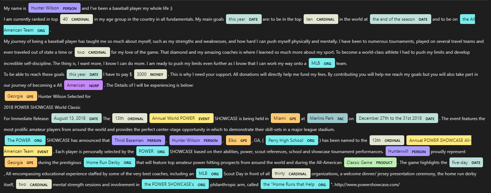

# Analysis of Sports Crowdfunding Campaigns.

## Executive Summary

Our analysis of sports crowdfunding campaigns reveals that of the 1,143 campaigns in the sample, only 5.8% were successful, indicating that it is very hard to compete for funds in the sports crowdfunding market. A few exceptions are present for the rule with funds raised more than 200% than their funding goals. United States and Canada lead the pack among the geographical distribution with over 50% campaigns from these two countries. We see that factors such as individual or team type campaign, state, country, etc. affect the crowdfunding outcomes. We also observe that the sports crowdfunding is highly concentrated in the team-based sports rather than individual sports. All these insights can lead into a predictive model which can be used to predict crowdfunding outcomes.

#### Idea
Analysis of reward-based sports crowdfunding campaigns from the SportFunder website, aimed at supporting the entrepreneurs, crowdfunders, and investors, through consulting<br>
#### Business Opportunity
We aim to develop a business model with the sports campaign creators (individuals and small businesses) as our primary customers, whom we aim to offer consulting services on developing successful campaigns. The success framework that we develop through an empirical analysis of the crowdfunding data of sports campaigns will serve as the backbone of our services. The services will primarily include:
* Defining the structure and launch plan of the crowdfunding campaign – funding goal, campaign duration, rewards and reward tiers
* Providing personalized feedback on the storytelling approach and text used in the campaign. Also guide the creators on videos and images
* Support the creators on marketing and PR activity – primarily, utilization of social media and other channels for campaign promotion

#### Importance
* Crowdfunding, formally defined as “a method of collecting small contribu­tions through an online funding platform or site from a large number of funders” (Li & Huang, 2020, p. 85) has emerged as major source of financing for individual creators and businesses alike, with ~ $13.5 billion market size in 2021, which is expected to grow to ~$28.2 billion by 2028 (Globe NewsWire, 2022). Not only has the crowdfunding topic been of academic research interest with over 140 manuscripts published in the last decade – Appendix A, but it has led to development of novel business models primarily aimed at supporting the campaign creators. For instance, the largest rewards-based crowdfunding platform Kickstarter offers the Experts service with the aim that they can leverage their data and experience in working with successful crowdfunding campaigns to the benefit of new creators (Kickstarter, n.d.).
* Interestingly, factors affecting rewards-based crowdfunding outcomes are not consistent across sectors or industries, hence disparate research exists on the analysis of crowdfunding success – such as in music (e.g., Mendes-Da-Silva et al., 2016), restaurants (e.g., Kedas & Sarkar, 2022), theatre (e.g., Frydrych et al., 2014), among many others. We particularly aim to look at sports crowdfunding, as it is a growing niche, with increasing interest from both academicians and practitioners, and our work might push the current state of knowledge in the sports crowdfunding area and potentially pave way for a new business. 
* Narcissism has been shown to play a major role in determining if entrepreneurs succeed in attracting funds for their crowdfunded ventures (Anglin et al., 2018). Based on the insights of their study, we also aim to see if narcissism plays a significant role in Sports Crowdfunding. 

#### Sources (Citations)
* Anglin, A. H., Wolfe, M. T., Short, J. C., McKenny, A. F., & Pidduck, R. J. (2018). Narcissistic rhetoric and crowdfunding performance: A social role theory perspective. Journal of Business Venturing, 33(6), 780-812.
* Frydrych, D., Bock, A. J., Kinder, T., & Koeck, B. (2014). Exploring entrepreneurial legitimacy in reward-based crowdfunding. Venture capital, 16(3), 247-269.
* Globe Newswire, (April 12, 2022). “Demand for Global Crowdfunding Market Size & Share to Surpass USD 28.2 Billion by 2028, Exhibit a CAGR of 11.8% | Industry Trends, Status, Revenue, Opportunities, Segmentation Analysis & Forecast Report by Facts & Factors”, Globe Newswire, Retrieved from https://www.globenewswire.com/news-release/2022/04/12/2420860/0/en/Demand-for-Global-Crowdfunding-Market-Size-Share-to-Surpass-USD-28-2-Billion-by-2028-Exhibit-a-CAGR-of-11-8-Industry-Trends-Status-Revenue-Opportunities-Segmentation-Analysis-Forec.html 
* Kedas, S., & Sarkar, S. (2022). Putting your money where your mouth is–the role of rewards in a value-based understanding of restaurant crowdfunding. International Journal of Contemporary Hospitality Management, (ahead-of-print).
* Kickstarter, (n.d.). “Kickstarter Experts”, Retrieved from https://www.kickstarter.com/experts
* Li, M., & Huang, Y. (2020). Crowdfunding in sport management. In Managing Sport Across Borders (pp. 83-100). Routledge.
* Mendes-Da-Silva, W., Rossoni, L., Conte, B. S., Gattaz, C. C., & Francisco, E. R. (2016). The impacts of fundraising periods and geographic distance on financing music production via crowdfunding in Brazil. Journal of Cultural Economics, 40(1), 75-99.


## Statement of Scope
The goal of the project is to identify the factors that affect the success or failure of a sports crowdfunding campaign. The secondary goal is to study the effects of narcissistic rhetoric on crowdfunding performance in sports crowdfunding. We look at the role the different dimensions of narcissism play in the funding performance.

 The insights from the study would be beneficial for entrepreneurs and academicians in the sports crowdfunding field. If we can successfully develop or implement a tool derived to enable creators of sports crowdfunding campaigns to analyse their campaign and finetune it as per the different factors identified for success, we can market the tool as a potential business solution.

A) Project Objectives

1.  To scrape the data on crowdfunding campaigns from the sports crowdfunder website **Sportfunder** 
2. Clean and store the data in a machine readable format
3.  Conduct an exploratory analysis to identify the factors that might affect the crowdfunding outcomes - binary outcome (success or failure) and funding received as a percent of funding goal (\%) 
4.  Explore the variation in crowdfunding outcomes and percent of funding goal raised with respect to various factors such as country, state, type of campaign, sport etc.

Unit of Analysis: In our analysis, we have looked at two primary units of analysis - the crowdfunding campaign and associated with it  - the crowdfunding outcome, captured by a binary variable __Success__ (Success = 1, Failure = 0) and the extent to which the crowdfunding campaing succeeded or failed, be captured by a continuous variable __Funds Received Pct__ (% of funding goal achieved). For ex., a successful crowdfunding campaign might have received $ 4000 for a funding goal of $ 2000, this indicates that for that crowdfunding campaign __Success__ = 1 and __Funds Received Pct__ = 4000/2000 * 100 = 200%


## Data Preparation
##### Summary

The diagram, which is presented below, shows step by step process utilized to generate final data which was used in visualization and further analysis


---
In order to understand the performance of crowdfunding campaigns, the data was scraped from website https://sportfunder.com<br>
* The website homepage shows cards for all campaigns with some basic info like date, expected and raised funds, supporters
* Clicking each campaign card opens up more details about specific campaign providing detailed descriptions
So, for each campaign some data was scraped from main page of website and further details were scraped from individual campaign page<br>

Key Files - Codes, Datasets
---
Codes
* [main.py](/code/data_scraping/main.py) is the Python file used to scrape the data from main page of the website https://sportfunder.com
* [campaign.py](/code/data_scraping/campaign.py) is the Python file used to scrape more details of each campaign after going into individual campaign pages
* [data_cleaning.py](code/data_cleaning/data_cleaning.py) is the Python file used for cleaning and transformation of scraped data and analysis of missing values
* [exploratory_data_analysis.py](/code/deliverable_1_analysis/exploratory_data_analysis.py) is the Python file used for generating visualizations and analyzing final data
* [narcissism.py](/code/deliverable_1_analysis/narcissism.py) is the Python file used for cleaning the text of the campaign stories and generating the raw word count scores for narcissism dimensions
* [data_consolidation.py](/code/data_cleaning/data_consolidation.py) is the Python file used for merging multiple dataframes, dropping columns with missing values, generating final narcissism word counts
* [factor_analys.R](/code/deliverable_1_analysis/factor_analysis.R) is the R file used for data reduction - factor analysis of narcissism word counts
* [text_analysis.R](/code/text_analysis/text_analysis.R)is the R file used for sentiment analysis - creates new datasets with sentiment-specific word counts. 
* [sentiment_analysis.R](/code/text_analysis/sentiment_analysis.R)is the R file used for sentiment classification
* [topic_modeling.py](/code/text_analysis/topic_modeling.py) is the Python file used for topic modelling - built LDA model to identify topics and generated visualizations for topics
* [named_entity_recognition.py](/code/text_analysis/named_entity_recognition.py) is the R file used for named entity recognition where entities were extracted for every story
* [data_sampling.R](/code/data_analysis/data_sampling.R) is the R file used for performing Stratified sampling and generate train, test datasets
* [classification_analysis.py](/code/data_analysis/classification_analysis.py) is the Python file used to build neural network models for different combinations of activation functions and hidden layers
* [parameter_estimation.R](/code/data_analysis/parameter_estimation.R) is the R file used to build and assess the assumptions of logistic regression, decision tree models

---
Data tables and Data dictionary
* [main_data_clean.csv](/data/clean_data/main_data_clean.csv) contains the final data set generated after scraping and cleaning, and this data set was used for the analysis
* [DataDictionary.csv](/data/clean_data/DataDictionary.csv) is the data dictionary of final dataset
Raw data (uncleaned)
* [raw_data_main.csv](/data/raw_data/raw_data_main.csv) contains raw (uncleaned) data which was scraped from website https://sportfunder.com
* [raw_data_campaigns.csv](/data/raw_data/raw_data_campaigns.csv) contains raw (uncleaned) data which was scraped from website https://sportfunder.com
* [final_data_merged.csv](/data/clean_data/final_data_merged.csv) contains merged data from the two main raw data files - main and campaigns
* [final_data_merged_storycleaned.csv](/data/clean_data/final_data_merged_storycleaned.csv.csv) contains the cleaned story texts - removing noise, special characters, alphanumeric phrases etc.
* [final_data_merged_storycleaned_wordcounts.csv](/data/clean_data/final_data_merged_storycleaned_wordcounts.csv) contains the data coming from the narcissism.py as well as the original data - the wordcounts across each narcissism dimensions
* [final_dataset_analysis.csv](/data/clean_data/final_dataset_analysis.csv) is the final dataset with multiple columns dropped as per the % of missing values
* [final_dataset_textanalysis.csv](/data/clean_data/final_dataset_textanalysis.csv) is an extension of [final_dataset_analysis.csv](/data/clean_data/final_dataset_analysis.csv) that includes an additional field indicating the language of the "story_original" variable
* [final_dataset_textanalysis_sentiment_score_updated.csv](/data/clean_data/final_dataset_textanalysis_sentiment_score_updated.csv) contains sentiment scores for the selected sentiment pairs
* [raw_dataset_withsentimentscores_withouterrors.csv](/data/data_analysis/raw_dataset_withsentimentscores_withouterrors.csv) is the dataset(with sentiment scores) obtained after correcting datapoints that were not scraped appropriately
* [final_data_train.csv](/data/data_analysis/final_data_train.csv) is the final train dataset used for modelling
* [final_data_test.csv](/data/data_analysis/final_data_test.csv) is the final test dataset used for modelling

---


### Data Access

#### Using Selenium driver to access Sportfunder

Selenium webdriver with Chrome browser was used to access and scrape data from crowdfunder.com. Window size was set to 1920 X 1080 pixel to enhannce scraping capabilities of the webdriver. After accessing each URl a sleep/hold of 5 seconds was added to  allow the ull webpage to load.

```Python
driver_path = "C:\chromedriver\chromedriver.exe"
driver = webdriver.Chrome(driver_path)
driver.set_window_position(0,0)
driver.set_window_size(1920,1080)

sportfunder_url = "https://sportfunder.com/"
driver.get(sportfunder_url)

time.sleep(5)

```

#### Identifying the key metadata and corresponding xpaths

Key descriptors such as campaign name, sport type, campaigner's name etc. of each campaign were identified from the all campaigns webpage. Xpaths for each of the key descriptors were identiefied and later used to scarpe respective descriptors. Sample code for some of the key descriptors and theor xpaths are shown below.

```Python

         
campaign_name = driver.find_element(By.XPATH, "/html/body/div[1]/section/div[1]/div[1]/div[2]/div[{}]/div[{}]/div/div[1]/a/h5".format(row_iter, column_iter)).text
            

```

| Descriptor Name | XPATH | 
|:---|:---|
| Campaign Name | /html/body/div[1]/section/div[1]/div[1]/div[2]/div[{}]/div[{}]/div/div[1]/a/h5 |
| Campaign URL | /html/body/div[1]/section/div[1]/div[1]/div[2]/div[{}]/div[{}]/div/div[1]/a |
| Campaign Pic | /html/body/div[1]/section/div[1]/div[1]/div[2]/div[{}]/div[{}]/div/a[1]/div |
| Profile Pic | /html/body/div[1]/section/div[1]/div[1]/div[2]/div[{}]/div[{}]/div/a[2]/div |
| Sport | /html/body/div[1]/section/div[1]/div[1]/div[2]/div[{}]/div[{}]/div/div[3]/a |
| Sport URL | /html/body/div[1]/section/div[1]/div[1]/div[2]/div[{}]/div[{}]/div/div[3]/a |
| Short Description | /html/body/div[1]/section/div[1]/div[1]/div[2]/div[{}]/div[{}]/div/p |
| Location | /html/body/div[1]/section/div[1]/div[1]/div[2]/div[{}]/div[{}]/div/div[2] |

<br>


### Data Scraping

#### Iterative data scraping

In the sportsfunding website, campaigns are arranged in 3 columns and 2 rows. To load more campaigns, "load more" button must be clicked. Using Xpaths, each of the campaign tiles were idendified and key descriptors were scraped. Once all 6 campaigns in the page were scraped, we leveraged the xpath of "load more"  button and a flag variable to make the scrapping iterative and smooth. A hold of 5 secs was added to load the full page before next iteration of scrapping begins. Please find below sample code for the process. 
```Python

           while row_iter < 100000:
    
    # check if iter div is present, if not load more
    try:
        print(row_iter)
        driver.find_element(By.XPATH, "/html/body/div[1]/section/div[1]/div[1]/div[2]/div[{}]/div[1]/div/div[1]/a/h5".format(row_iter))
        print("click worked")
        load_more_flag = 0
    except:
        load_more_flag = 1
    
    # each row has 3 campaigns
    # control flow for load more    
    if load_more_flag == 1 :
        driver.find_element(By.XPATH, loadmore_xpath).click()
        print("loaded more data")
        # row_iter += 1
        time.sleep(5)
    else: 
        for column_iter in range(1,4):
            sleep(1)
            try:
                campaign_name = driver.find_element(By.XPATH, "/html/body/div[1]/section/div[1]/div[1]/div[2]/div[{}]/div[{}]/div/div[1]/a/h5".format(row_iter, column_iter)).text
            except:
                campaign_name = "NULL"
```
#### Dealing with issues

In some of the campaigns, key descriptors were absent. To accomodate the missing descriptors and ensure continous iteration try and except block were added for each of the decriptors while assigning Xpaths in the code.
```Python

try:
                campaign_name = driver.find_element(By.XPATH, "/html/body/div[1]/section/div[1]/div[1]/div[2]/div[{}]/div[{}]/div/div[1]/a/h5".format(row_iter, column_iter)).text
            except:
                campaign_name = "NULL"
```

#### Data storing in csv files

After all required data was scraped and webdriver was stopped, all key descriptors ere stored in a dataframe as variables. This raw data was saved to a csv file named [Raw_Data](/data/raw_data/raw_main_363_378.csv) under data/raw_data folder.  


```Python

data = {'CampaignName': campaign_name_list, 'CampaignUrl': campaign_url_list, 'CampaignPicUrl': campaign_pic_url_list, 'ProfilePicUrl': profile_pic_url_list, 
                'SportName': sport_list, 'SportUrl': sport_url_list, 'ShortDescription': short_desc_list, 'Location': location_list, 
                'DivBox1Val': div_box_1_val_list, 'DivBox1Name': div_box_1_name_list, 'DivBox2Val': div_box_2_val_list, 'DivBox2Name': div_box_2_name_list,
                'DivBox3Val': div_box_3_val_list, 'DivBox3Name': div_box_3_name_list, 'DivBox4Val': div_box_4_val_list, 'DivBox4Name': div_box_4_name_list}
df = pd.DataFrame.from_dict(data)
df.to_csv("c:\\Users\\tharun\\OneDrive - Oklahoma A and M System\\Documents\\GitHub\\project-deliverable-2-invincible\\data\\raw_data\\raw_data_main.csv")

```

#### 

### Data Cleaning

1. Removing the redundant text from "campaign urls"
--- 
* The data we have before the cleaning was : "https://sportfunder.com/https://sportfunder.com/scotthill/7894"
* The data we have after cleaning : "https://sportfunder.com/scotthill/7894"
---
```python
     def clean_campaignurl(row):
	 campaignurl_unclean = str(row['CampaignUrl'])
	 campaignurl_clean = campaignurl_unclean.removeprefix('https://sportfunder.com/')
	 return campaignurl_clean
```

2. Removing the redundant text from "CampaignPicUrl" 
---
* The data we have before the cleaning was : "background-image: url("https://www.filepicker.io/api/file/YGfT1eD7RHigkfCWluTp/convert?w=400");"
* The data we have after cleaning : "https://www.filepicker.io/api/file/YGfT1eD7RHigkfCWluTp/convert?w=400"
---

```python

    def clean_campaignpicurl(row):
    cppicurl_unclean = str(row['CampaignPicUrl'])
    cppicurl_clean = cppicurl_unclean.removeprefix('background-image: url("')
    cppicurl_clean_1 = cppicurl_clean.removesuffix("\");")
    return cppicurl_clean_1
```

3. Removing the redundant text from "ProfilePicUrl" 
---
* The data we have before the cleaning was : 
"background-image: url("background-image: url("https://www.filepicker.io/api/file/VfCCtqcvR3KD1O1bFSv6/convert?w=400");"
* The data we have after cleaning : "https://www.filepicker.io/api/file/YGfT1eD7RHigkfCWluTp/convert?w=400"
---

```python

    def clean_campaignpicurl(row):
    cppicurl_unclean = str(row['CampaignPicUrl'])
    cppicurl_clean = cppicurl_unclean.removeprefix('background-image: url("')
    cppicurl_clean_1 = cppicurl_clean.removesuffix("\");")
    return cppicurl_clean_1
```

4. Removing the redundant text from "SportUrl"
--- 
* The data we have before the cleaning was : "https://sportfunder.com/https://sportfunder.com/teams/cross-country-skiing"
* The data we have after cleaning : "https://sportfunder.com/teams/cross-country-skiing"
---
```python 
    def clean_sporturl(row):
    sporturl_unclean = str(row['SportUrl'])
    sporturl_clean = sporturl_unclean.removeprefix('https://sportfunder.com/')
    return sporturl_clean
```
5. Treating Missing Values
--- 
* Python library "missingno" was used to visualize missing values in each column in final merged datafarme. Varibales with total percentage of missing values are listed as below.
* SportName(1.84%), ShortDescrption(0.017%), numSupporters(0.03%), City(8.04%), State(17%), Country(28.7%), TeamOrAthlete(1.84%), DonationsRaised(18.3%), ParentCampaign(93.7%), CreatorCampaigns(18.3%), CreatorSupporters(53%), SportType(19.7%), Story(18.7%) and CreatorBio(100%) columns had missing values. 

<p align="center">
    
</p> 

* Out of thise ParentCampaign, CreatorSupporters and CreatorBio columns are dropped from dataframe for further analysis, since these columns had more than 50% missing values and may impact model fit and output.

6. Analysing Distributions and Detecting outliers
--- 
* To analyze distributions and detecting potential outliers in numeric variables, QQ plots, histograms and boxplots were used.

<p align="center">
    
</p> 

* Downward bow shaped QQ plots show that numSupporters, FundsRaisedPercent, AmountAdjusted, Wordcount and NarcissismFactor variables may be heavily right skewed.
<p align="center">
    
</p>

* Respective histograms of above mentioned variables confirm that numeric variables are heavily right skewed. For modelling porposes, log transformation is needed for each of these variables. 
<p align="center">
    
</p> 

* After log transformations the distributions of numerical variables have become more appropriate for modelling purposes as seen in the above boxplots. There are some potential outliers in Wordcount variables which are out of interquartile range and these potential outliers need to be analyzed further. For modelling purposes records contaning these outlies need to be discarded from further analysis and modelling for bteer model fit and predictions. 


### Data Transformation

1. Transformation the location to City, State, Country

--- 
* The data we have before the cleaning was : "Thunder Bay, Ontario, Canada"

<p align="center">
    
</p>

* The data we have after cleaning : City- "Thunder Bay", State- "Ontario", Country- "Canada"
---
```python 
    df_clean[['City', 'State', 'Country']] = df_clean['Location'].str.split(pat= ", ", expand= True)
```


2. Identifying Team or Athelete from Sport URL
-- 
* The data we have before the cleaning was : "https://sportfunder.com/https://sportfunder.com/teams/cross-country-skiing"

<p align="center">
    
</p>

* The data we have after cleaning : City- "teams"
---
```python 
    def clean_sporturl(row):
    sporturl_unclean = str(row['SportUrl'])
    sporturl_clean = sporturl_unclean.removeprefix('https://sportfunder.com/https://sportfunder.com/')
    sporturl_clean_final = sporturl_clean.split("/", 1)[0]
    return sporturl_clean_final
    
```


3. Differentiating the currency
-- 
* The data we have before the cleaning was : "€9,301", "£2,747.25", "¥0","₽0","$5"

<p align="center">
    
</p>

* The data we have after cleaning : City- "Euro", "Pound", "Yen", "Russian Rubel", "USD"
---
```python 
df_clean['Currency'] = df_clean['Money Raised'].str[0]
df_clean['Amount'] = df_clean['Money Raised'].str[1:]
df_clean['Currency'] = np.where(df_clean['Currency'] == '$', 'USD', df_clean['Currency'])
df_clean['Currency'] = np.where(df_clean['Currency'] == '¥', 'Japanese Yen', df_clean['Currency'])
df_clean['Currency'] = np.where(df_clean['Currency'] == '£', 'Pound', df_clean['Currency'])
df_clean['Currency'] = np.where(df_clean['Currency'] == '₽', 'Russian Rubel', df_clean['Currency'])
df_clean['Currency'] = np.where(df_clean['Currency'] == '€', 'Euro', df_clean['Currency'])
df_clean
    
```


4. Success variable - 1 if successful, 0 if failed

* We are creating a new variable that is Success variable - it is a categorical variable
* If the Funds Raised Pct variable > 100% consider as successful denoted by 1 else failed denoted by 0
---
```python 
def crowdfunding_outcome(row):
    fundsraisedpct = int(row['Funds Raised Pct'])
    if fundsraisedpct > 100 :
        return 1
    else:
        return 0
    
```

5. Creating Narcissism dimensions and their word counts
* The campaign descriptions are first cleaned by converting to lower case letters and then removing noise - special characters
* Then RegEx is used to look for words containing only letters
---
```python
def remove_noise_lower(sent):
    for ch in ['\\', '`', '+', '*', '&', '-', '_', '!', '>', '<', '?', '$', '.', ';', '\"', ':']:
        if ch in sent:
            sent = sent.replace(ch, " ")
    sent = sent.replace(",", " ")
    sent = sent.translate(string.punctuation)
    sent = sent.lower()
    return sent

def tokenize_advanced_2(sent):
    tokenizer = RegexpTokenizer('\w+|\$[\d\.]+|\S+')
    return tokenizer.tokenize(sent)

```

* The text of Campaign descriptions or stories are then tokenized, creating a new column called StoryCleaned
---
```python
df['Story'] = df['Story'].apply(remove_noise_lower)
df['StoryCleaned'] = ''
df['Wordcount'] = ''
for i in range(0, df.shape[0]):
    tokenized_sent = remove_noise_sent(tokenize_advanced_2(df['StoryCleaned'].iloc[i]))
    
    df['Wordcount'].iloc[i] = len(tokenized_sent)
    df['StoryCleaned'].iloc[i] = return_cleanedtext(tokenized_sent)

df.to_csv("{}/data/clean_data/final_data_merged_storycleaned.csv".format(cwd))
```

* For each dimension in the Narcissism dimensions, a count vectorizer is initialized to count the number of bi-grams and then the raw score for each of the bi-grams is stored in the raw score
---
```python
for dimension in ['authority', 'superiority', 'exhibitionism', 'vanity', 'selfsufficiency', 'entitlement', 'exploitativeness']:
    phrases_list = narcissism_wordlist_df['{}'.format(dimension)].dropna().tolist()
    vectorizer = CountVectorizer(ngram_range = (1,2), vocabulary = list(set(phrases_list)))
    matrix = vectorizer.fit_transform(df.StoryCleaned)
    counts = pd.DataFrame(matrix.toarray(), index = df.CampaignURL, columns=vectorizer.get_feature_names_out())
    counts.to_csv("{}/data/narcissism_raw_data/{}_rawscores.csv".format(cwd,dimension))
```

6. Removing the redundant text from "Money Raised"
--- 
* The data we have before the cleaning was : "$4,056\r\nRaised"
* The data we have after cleaning : "$4,056"
---
```python 
    def clean_money_raised(row):
    moneyraised_unclean = str(row['DivBox1Val'])
    moneyraised_clean = moneyraised_unclean.removesuffix("\r\nRaised")
    return moneyraised_clean
```
<p align="center">
    
</p>

7. Removing the redundant text from "Per Fund Raised"
--- 
* The data we have before the cleaning was : "$697%\r\nFunded"
* The data we have after cleaning : "697"
---
```python 
    def per_funded(row):
    funded_unclean = str(row['DivBox2Val'])
    funded_clean = funded_unclean.removesuffix("%\r\nFunded")
    return funded_clean
```
<p align="center">
    
</p>

8. Removing the redundant text from "number of supporters"
--- 
* The data we have before the cleaning was : "8\r\nSupporters"
* The data we have after cleaning : "8"
---
```python 
    def nof_supporters(row):
    supporter_unclean = str(row['DivBox4Val'])
    supporter_clean = supporter_unclean.removesuffix("\r\nSupporters")
    return supporter_clean
```
<p align="center">
    
</p>

9. After the Data Reduction, a new variable NarcissismFactor was created based on the factor analysis output
---
* This factor combines the different dimensions using a specific weight as the factor analysis output shows
* This factor will be used for our analysis instead of individual wordcounts of each dimension
---
```python
 Factor Analysis output
# authority - 0.612, superiority - 0.9, exhibitionism - 0.92, vanity - 0.737, selfsufficiency - 0.628
# entitlement - 0.509
main_df['NarcissismFactor'] = main_df['authority'] * 0.612 + main_df['superiority'] * 0.9 \
                            + main_df['exhibitionism'] * 0.92 + main_df['vanity'] * 0.737 \
                            + main_df['selfsufficiency'] * 0.628 + main_df['entitlement'] * 0.509
```


### Data Reduction
* We used factor analysis to identify the latent factors driving the narcissistic dimensions from text
* First we only looked at campaigns with number of words in the story greater than equal to 5, which were 921 campaigns out of 1143
---
```R
# Loading the data
narcData <- read.csv(paste(getwd(),"/data/clean_data/final_data_merged_storycleaned_wordcounts.csv",sep=""))
narcData <- narcData[narcData[,"Wordcount"] >= 5,]
```
* Following this we conducted a factor analysis with number of factors = 3. We observed that only one factor had an eigen-value greater than 1. Indicating that the number of factors to be considered is only one.
---
```R
# Factor Analysis of all data (all campaigns with some presence of any narcissism and word length >= 5)
narc.fa <- factanal(narcData[, 27:33], factors = 3, rotation = "promax")
narc.fa
```
<p align="center">
    
</p>


* To confirm this, we conducted a Parallel Analysis, the scree plot shows that only one factor needs to be considered. 
---
```R
# Parallel analysis to confirm the number of factors to be used
#install.packages("paran")
library(paran)
narc.pa <- paran(narcData[, 27:33], cfa = TRUE, graph = TRUE, color = TRUE,
                 col = c("black", "red", "blue"))
```
<p align="center">
    
</p>

* Following this we conducted a factor analysis with number of factors = 3. We observed that only one factor had an eigen-value greater than 1. Indicating that the number of factors to be considered is only one.
---
```R
# Parallel Analysis shows that only one factor is to be used
narc.fa <- factanal(narcData[, 27:33], factors = 3, rotation = "promax")
narc.fa
```
<p align="center">
    
</p>


### Data Consolidation
--- 
* The data was scraped in 2 phases, first the data was scraped from main page of website which gave us URLs for each campaign page and some more basic details which was stored as [raw_data_main.csv](/data/raw_data/raw_data_main.csv), secondly the URLs were used to access each campaign page and detailed information for each campaign was scraped from individual campaign page and stored as [raw_data_campaignstories.csv](/data/raw_data/raw_data_campaignstories.csv).
* These 2 dataset had "CampaignURL" as a key. Datasets were merged using "CampaignURL" and the code used to merge the dataframes is saved as [data_consolidation.py](/code/data_consolidation.py) and can be seen below
```python
    df = df1.merge(df2, left_on='CampaignUrlClean' , right_on='CampaignUrl', how='left')
```
* The merged dataset contained some extra columns, which were removed.
```python
    df = df.drop(columns=['Campaign URL cleaned','Profile URL cleaned',
                 'CampaignUrl','%Raised','Funding Goal',
                 'Days Left','Url 1', 'Url 2', 'Url 3', 'Url 4', 'Url 5'])
```
* Some column names were changed to cammelcase format.
```python
    df = df.rename(columns = {"Money Raised":"FundsRaised",
                     "CampaignUrlClean":"CampaignURL",
                     "number of supporters":"numSupporters",
                     "Funds Raised Pct":"FundsRaisedPercent",
                     "Team/Athlete":"TeamOrAthlete",
                     "Donation Raised":"DonationRaised",
                     "Parent Campaign":"ParentCampaign",
                     "Creator Campaigns":"CreatorCampaigns",
                     "Creator Supporters":"CreatorSupporters",
                     "Sport Type":"SportType",
                     "Creator Bio":"CreatorBio"})
```

* The merged file is used in the creation of narcissism scores and the final data consolidation is done after the creation of narcissism for each dimension
---
```python
main_df = pd.read_csv("{}/data/clean_data/final_data_merged_storycleaned.csv".format(cwd))
main_df = main_df.set_index('CampaignURL')
# print(main_df.head())
# Creating dimensional word counts for each narcissism dimension
or dimension in ['authority', 'superiority', 'exhibitionism', 'vanity', 'selfsufficiency', 'entitlement', 'exploitativeness']:
    df = pd.read_csv("{}/data/narcissism_raw_data/{}_rawscores.csv".format(cwd, dimension))
    df = df.set_index(['CampaignURL'])
    main_df[dimension] = df.sum(axis = 1)
```

* The final dataset that will be used for analysis does not contain multiple columns and can be found as [Final_Dataset_Analysis](/data/clean_data/final_dataset_analysis.csv)
* Column names of final data can be seen in the image below

<p align="center">
    
</p>


### Data Dictionary
We have 1143 observations of following variables.<br>
[DataDictionary](/data/clean_data/DataDictionary.csv)<br>
| Attribute Name | Description | Data Type | Source | Data | Example |
|:---|:---|:---:|:---|:---|:---:|
| CampaignName | Name of the campaigner | String | https://sportfunder.com/ | [final_dataset_analysis.csv](/data/clean_data/final_dataset_analysis.csv) | SCOTT HILL |
| SportName | Name of the sport | String | https://sportfunder.com/ | [final_dataset_analysis.csv](/data/clean_data/final_dataset_analysis.csv) | Cross Country Skiing |
| ShortDescription | Short description about campaign | String | https://sportfunder.com/ | [final_dataset_analysis.csv](/data/clean_data/final_dataset_analysis.csv) | TeamUp "KICK OFF" Campaign |
| CampaignURL | Link for the campaign page | String | https://sportfunder.com/ | [final_dataset_analysis.csv](/data/clean_data/final_dataset_analysis.csv) | https://sportfunder.com/scotthill/7894 |
| FundsRaised | amount raised | String | https://sportfunder.com/ | [final_dataset_analysis.csv](/data/clean_data/final_dataset_analysis.csv) | 5230 |
| SportUrlClean | Link to search type of sport | String | User defined | [final_dataset_analysis.csv](/data/clean_data/final_dataset_analysis.csv) | https://sportfunder.com/teams/cross-country-skiing |
| numSupporters | Count of supporters | Numeric (Integer) | https://sportfunder.com/ | [final_dataset_analysis.csv](/data/clean_data/final_dataset_analysis.csv) | 8 |
| FundsRaisedPercent | Amount of funds raised divided by funding goal in percent terms | Numeric (Integer) | https://sportfunder.com/ | [final_dataset_analysis.csv](/data/clean_data/final_dataset_analysis.csv) | 697 |
| City | City of the campaign | String | User defined | [final_dataset_analysis.csv](/data/clean_data/final_dataset_analysis.csv) | Thunder Bay |
| State | State of the campaign | String | User defined | [final_dataset_analysis.csv](/data/clean_data/final_dataset_analysis.csv) | Ontario |
| Country | Country of the campaign | String | User defined | [final_dataset_analysis.csv](/data/clean_data/final_dataset_analysis.csv) | Canada |
| Currency | Type of currency for donations | String | User defined | [final_dataset_analysis.csv](/data/clean_data/final_dataset_analysis.csv) | Euro |
| Amount | Amount of the donation | Numeric (Float) | User defined | [final_dataset_analysis.csv](/data/clean_data/final_dataset_analysis.csv) | 9301 |
| TeamOrAthlete | Type of campaign target | String | https://sportfunder.com/ | [final_dataset_analysis.csv](/data/clean_data/final_dataset_analysis.csv) | teams or atheletes |
| AmountAdjusted | Adjusted amout of donation (In US dollars) | Numeric (Float) | User defined | [final_dataset_analysis.csv](/data/clean_data/final_dataset_analysis.csv) | 9240.5435 |
| Success | Final outcome of the crowdfunding campaign | Binary | User defined | [final_dataset_analysis.csv](/data/clean_data/final_dataset_analysis.csv) | 0 or 1 |
| DonationRaised | Amount shown in individual campaign page along with currency type | Numeric (Float) | https://sportfunder.com/ | [final_dataset_analysis.csv](/data/clean_data/final_dataset_analysis.csv) | $1300.00, £1390.00 |
| ParentCampaign | The parent event, which the campaign is the part of | string | User defined | [final_dataset_analysis.csv](/data/clean_data/final_dataset_analysis.csv) | 2014 Team Alberta Rugby |
| CreatorCampaigns | Number of campaigns created by this campaign creator | Numeric (Integer) | https://sportfunder.com/ | [final_dataset_analysis.csv](/data/clean_data/final_dataset_analysis.csv) | 1, 2, 3 |
| CreatorSupporters | number of supporters of this campaign creator | Numeric (Integer) | https://sportfunder.com/ | [final_dataset_analysis.csv](/data/clean_data/final_dataset_analysis.csv) | 1, 2, 3 |
| SportType | Type of sport | Nominal | User defined | [final_dataset_analysis.csv](/data/clean_data/final_dataset_analysis.csv) | Baseball |
| Story | The detailed description of the campaign mentioning motives and activities of the campaign creator | String | User defined | [final_dataset_analysis.csv](/data/clean_data/final_dataset_analysis.csv) | This campaign is designed to help me and my mom pay for … |
| CreatorBio | Detail about campaign creator | String | User defined | [final_dataset_analysis.csv](/data/clean_data/final_dataset_analysis.csv) |  |
| StoryCleaned | Cleaned text from Story after Text mining operations | String | Analyst generated | [final_dataset_analysis.csv](/data/clean_data/final_dataset_analysis.csv) | campaign designed help mom pay fees horseback horse shows … |
| Wordcount | Count of words in cleaned story | Numeric (Integer) | Analyst generated | [final_dataset_analysis.csv](/data/clean_data/final_dataset_analysis.csv) | 147, 298, 45 |
| authority | Measure of Authority | Numeric (Integer) | Analyst generated | [final_data_merged_storycleaned_wordcounts.csv](/data/clean_data/final_data_merged_storycleaned_wordcounts.csv) | 0, 3, 14 |
| superiority | Measure of superiority | Numeric (Integer) | Analyst generated | [final_data_merged_storycleaned_wordcounts.csv](/data/clean_data/final_data_merged_storycleaned_wordcounts.csv) | 0, 3, 14 |
| exhibitionism | Measure of exhibitionism | Numeric (Integer) | Analyst generated | [final_data_merged_storycleaned_wordcounts.csv](/data/clean_data/final_data_merged_storycleaned_wordcounts.csv) | 0, 3, 14 |
| vanity | Measure of vanity | Numeric (Integer) | Analyst generated | [final_data_merged_storycleaned_wordcounts.csv](/data/clean_data/final_data_merged_storycleaned_wordcounts.csv) | 0, 3, 14 |
| selfsufficiency | Measure of selfsufficiency | Numeric (Integer) | Analyst generated | [final_data_merged_storycleaned_wordcounts.csv](/data/clean_data/final_data_merged_storycleaned_wordcounts.csv) | 0, 3, 14 |
| entitlement | Measure of entitlement | Numeric (Integer) | Analyst generated | [final_data_merged_storycleaned_wordcounts.csv](/data/clean_data/final_data_merged_storycleaned_wordcounts.csv) | 0, 3, 14 |
| exploitativeness | Measure of exploitativeness | Numeric (Integer) | Analyst generated | [final_data_merged_storycleaned_wordcounts.csv](/data/clean_data/final_data_merged_storycleaned_wordcounts.csv) | 0, 3, 14 |
| NarcissismFactor | Latent Factor driving Narcissism | Numeric (Float) | Analyst generated | [final_dataset_analysis.csv](/data/clean_data/final_dataset_analysis.csv) | 23.814, 0.628 |
| Joy | Sentiment Analysis using NRC Lexicon | Numeric (Float) | Analyst generated | [final_dataset_textanalysis_sentiment_score_updated.csv](/data/clean_data/final_dataset_textanalysis_sentiment_score_updated.csv) | 23.814, 0.628 |
| Sadness | Sentiment Analysis using NRC Lexicon | Numeric (Float) | Analyst generated | [final_dataset_textanalysis_sentiment_score_updated.csv](/data/clean_data/final_dataset_textanalysis_sentiment_score_updated.csv) | 23.814, 0.628 |
| Trust | Sentiment Analysis using NRC Lexicon | Numeric (Float) | Analyst generated | [final_dataset_textanalysis_sentiment_score_updated.csv](/data/clean_data/final_dataset_textanalysis_sentiment_score_updated.csv) | 23.814, 0.628 |
| Fear | Sentiment Analysis using NRC Lexicon | Numeric (Float) | Analyst generated | [final_dataset_textanalysis_sentiment_score_updated.csv](/data/clean_data/final_dataset_textanalysis_sentiment_score_updated.csv) | 23.814, 0.628 |
| Positive | Sentiment Analysis using NRC Lexicon | Numeric (Float) | Analyst generated | [final_dataset_textanalysis_sentiment_score_updated.csv](/data/clean_data/final_dataset_textanalysis_sentiment_score_updated.csv) | 23.814, 0.628 |
| Negative | Sentiment Analysis using NRC Lexicon | Numeric (Float) | Analyst generated | [final_dataset_textanalysis_sentiment_score_updated.csv](/data/clean_data/final_dataset_textanalysis_sentiment_score_updated.csv) | 23.814, 0.628 |


<br>

The purpose of each variable and desciption is presented in the table below<br>
| Attribute Name | Purpose |
|:---|:---|
| CampaignName | Name of campaign creator (can be athlete, team, or organization) |
| SportName | Shows name of the sport, the campaign is created for |
| ShortDescription | Description to be shown on the Home page campaign cards, Title for the campaign story |
| CampaignURL | Unique Identifier of each campaign as well as link to the individual campaign page |
| FundsRaised | Money raised to support this campaign |
| SportUrlClean | Link to the campaigns of same type of sports as the selected campaign sport type |
| numSupporters | count of Supporters for the particular campaign |
| FundsRaisedPercent | Percentage of expected funding which has been raised in fundings |
| City | Name of city from where campaign is run |
| State | Name of state from where campaign is run |
| Country | Name of country from where campaign is run |
| Currency | Type of currency for particular campaign |
| Amount | Number representing just the amount of fund without currency symbol |
| TeamOrAthlete | Used to identify whether the campaign is being run by single athlete of a team |
| AmountAdjusted | Raised Funds converted to Dollar amount |
| Success | Binary target variable representing whether specified expected fundings were raised or not |
| DonationRaised | Raised Funds scraped from individual campaign page |
| ParentCampaign | The primary event of which the campaign is a component |
| CreatorCampaigns | Number of campaigns created by this campaign creator |
| CreatorSupporters | number of supporters of this campaign creator |
| SportType | Type of sport obtained from individual campaign page |
| Story | The detailed description of the campaign mentioning motives and activities of the campaign creator |
| CreatorBio | Detail about campaign creator |
| StoryCleaned | Story after text mining operations (used for further analysis) |
| Wordcount | Count of words in cleaned story (Story Length) |
| authority | Measure of authority dimension in narcissism based on Anglin et al. 2018. Will be used in finding out the latent factor driving narcissistic rhetoric using factor analysis |
| superiority | Measure of superiority dimension in narcissism based on Anglin et al. 2018. Will be used in finding out the latent factor driving narcissistic rhetoric using factor analysis |
| exhibitionism | Measure of exhibitionism dimension in narcissism based on Anglin et al. 2018. Will be used in finding out the latent factor driving narcissistic rhetoric using factor analysis |
| vanity | Measure of vanity dimension in narcissism based on Anglin et al. 2018. Will be used in finding out the latent factor driving narcissistic rhetoric using factor analysis |
| selfsufficiency | Measure of selfsufficiency dimension in narcissism based on Anglin et al. 2018. Will be used in finding out the latent factor driving narcissistic rhetoric using factor analysis |
| entitlement | Measure of entitlement dimension in narcissism based on Anglin et al. 2018. Will be used in finding out the latent factor driving narcissistic rhetoric using factor analysis |
| exploitativeness | Measure of exploitativeness dimension in narcissism based on Anglin et al. 2018. Will be used in finding out the latent factor driving narcissistic rhetoric using factor analysis |
| NarcissismFactor | The final latent factor derived as a weighted average of individual dimensional wordcounts |
| Joy | The wordcount capturing the number of "Joy" expressing words in the campaign description |
| Sadness | The wordcount capturing the number of "Sadbess" expressing words in the campaign description |
| Trust | The wordcount capturing the number of "Trust" expressing words in the campaign description |
| Fear | The wordcount capturing the number of "Fear" expressing words in the campaign description |
| Positive | The wordcount capturing the number of "Positive" expressing words in the campaign description |
| Negative | The wordcount capturing the number of "Negative" expressing words in the campaign description |

## Descriptive Statistics and Analysis

### Loading the libraries and dataframe for analysis

We first loaded the libraries - matplotlib, pandas, and os for conducting exploratory data analysis. Further, we loaded the dataframe for pursuing visual explorations

```python 
import os
import pandas as pd
import seaborn as sns
import matplotlib.pyplot as plt
import numpy as np
from scipy.stats import binned_statistic
os.getcwd()

# Loading the dataframe Main Data
main_data_df = pd.read_csv(r"/Users/tharun/Documents/GitHub/project-deliverable-2-invincible/data/clean_data/final_dataset_textanalysis_sentiment_score_updated.csv")
main_data_df = main_data_df.drop(['Unnamed: 0.1', 'Unnamed: 0'], axis=1)
main_data_df.head()
    
```

### Descriptive Statistics Summary

<p align="center">
    
</p>

* We find that the variable numSupporters has a few missing values, on an average each campaign has 15.39 supporters, the standard deviation is high. Since it is a variable which cannot take negative numbers, the distribution is likely to be right skewed. Interestingly, there is a campaign which has garnered around 982 supporters. In our modeling, we need to take care that the variable is transformed before using it

* The other numerical variables do not have any missing values

* FundsRaisedPercent shows that on an average a campaign has raised 20.71% of the funding goal, with a certain campaign having raised 697% of the stipulated funding goal. The standard deviation is very high at 52.17%. This variable exhibits high right skew and needs to be transformed before using it in modeling purposes

* AmountAdjusted shows that on an average a campaign has received a funding of $682.77, with a certain campaign having raised about $32,347.74. The standard deviation is very high at $2053.78. This variable exhibits high right skew and needs to be transformed before using it in modeling purposes

* Wordcount shows that on an average a campaign has 122.15 words, with a certain campaign having raised about $32,347.74. The standard deviation is very high at $2053.78. This variable exhibits high right skew and needs to be transformed before using it in modeling purposes

* NarcissismFactor shows that the average of the value is 9.65 with a standard deviation of 10.1. The median is 8.06 and the maximum value is 77.614. The variable has to be normalized with respect to the number of words in the story of the campaign. In our modeling, we will use the normalized variable for our analysis

## Text Mining and Sentiment Analysis

Firstly, using the “final_dataset_analysis.csv” file, which was obtained from our previous deliverable, we have used the following function to identify the language of the text in the Story_Original column. 
After applying the function, we created a new binary variable named is_english and set it with a value of 1 for English and 0 for other languages.

	## Detect Language function
    def detect_language(text):
    try:
        lang = detect(text)
    except:
        lang = 'unknown'
    return lang

    ## apply the detect_language function to the ‘Story_Original’' column
    df['language'] = df['Story_Original'].apply(detect_language)


In the text analysis phase, we began by cleaning and preprocessing the raw text data. This involved removing stop words and stemming the remaining words to prepare the text for analysis. We then performed sentiment analysis on the text, specifically evaluating the joy and sadness, trust and fear, and positive and negative sentiments. The resulting dataset contained the sentiment scores for each word in the text, allowing us to further analyze and interpret the emotional tone of the stories.

After we arrived at our dataset consisting of words tagged to each sentiment, we looked at the most frequently used words corresponding to each of those sentiments. 
Here are top words and the word cloud of words that are associated with Joy-Sadness, Positive-Negative, Trust-Fear sentiment pairs:

<p align="center">
    
</p>

 Wordclouds for all sentiments:

<center>
  <table>
  <tr>
    <td align = 'center'>Joy</td>
    <td align = 'center'>Sadness</td>
    </tr>
    <tr>
      <td></td>
      <td></td>
    </tr>
    </table>
</center>
<center>
  <table>
<tr>
    <td align = 'center'>Positive</td>
    <td align = 'center'>Negative</td>
    </tr>
    <tr>
      <td></td>
      <td></td>
    </tr>
    </table>
</center>
<center>
  <table>
<tr>
    <td align = 'center'>Trust</td>
    <td align = 'center'>Fear</td>
    </tr>
    <tr>
    <td></td>
    <td></td>
    </tr>
  </table>
</center>


In addition to identifying the top words associated to a sentiment, we also looked at individual stories that have a high score for a particular sentiment to understand how the words align with what people actually say.
	
<p align="center">
    
</p>

As shown in the image above, we can see how the story tagged with a high sentiment score for Joy has words like Passion, Love and Success, while a story tagged with a high sentiment score for Fear has words like difficult, journey and fight being used.

Using the sentiment scores that were assigned to every campaign as showed in “final_dataset_textanalysis_sentiment_score.csv”, we have evaluated the overall sentiment of the campaign. 
To determine the overall sentiment, sentiment scores for specific sentiment pairs were compared, and the story was assigned the sentiment with the highest score. 
Following bar charts show the percentage of sentiment scores for different sports and countries, with the sports that have a 100% sentiment value for one sentiment excluded.
	
<p align="center">
    
</p>

<p align="center">
    
</p>


## Topic Modeling

We leveraged _spacy_ and _gensim_ libraries for our topic modeling. _gensim_ offers very good methods to conduct topic modeling and identify the optimal number of topics

**Text Preprocessing**

We took multiple steps in arriving at the final text data to be used for topic modeling:
<ul>
    <li> New line characters are removed from the text
    <li> Distracting single quotes are removed from the text
    <li> Stopwords are removed from the text
    <li> Bigrams generated from the text data after removed
    <li> Lemmatized text data but only retain nouns, verbs, adjectives and adverbs
</ul>

```Python
#%%
def sent_to_words(sentences):
    for sentence in sentences:
        yield(gensim.utils.simple_preprocess(str(sentence), deacc=True))  # deacc=True removes punctuations

# Initialize spacy 'en' model, keeping only tagger component (for efficiency)
# python3 -m spacy download en
nlp = spacy.load('en_core_web_sm', disable=['parser', 'ner'])

def remove_stopwords(texts):
    return [[word for word in simple_preprocess(str(doc)) if word not in stop_words] for doc in texts]

def make_bigrams(texts):
    return [bigram_mod[doc] for doc in texts]

def make_trigrams(texts):
    return [trigram_mod[bigram_mod[doc]] for doc in texts]

def lemmatization(texts, allowed_postags=['NOUN', 'ADJ', 'VERB', 'ADV', 'NUM', 'PRON']):
    """https://spacy.io/api/annotation"""
    texts_out = []
    for sent in texts:
        doc = nlp(" ".join(sent)) 
        texts_out.append([token.lemma_ for token in doc if token.pos_ in allowed_postags])
    return texts_out
```

```Python
# Loading Data Frame from clean data folder

df = pd.read_csv("{}/data/clean_data/final_dataset_textanalysis_sentiment_score.csv".format(os.getcwd()))
df.head()
# %%
data = df['Story_Original'].values.tolist()
# Remove new line characters
data = [re.sub('\s+', ' ', str(sent)) for sent in data]
# Remove distracting single quotes
data = [re.sub("\'", "", str(sent)) for sent in data]
data_words = list(sent_to_words(data))
# Build the bigram and trigram models
bigram = gensim.models.Phrases(data_words) # higher min_count or higher threshold fewer phrases.
# Faster way to get a sentence clubbed as a trigram/bigram
bigram_mod = gensim.models.phrases.Phraser(bigram)
# Remove Stop Words
data_words_nostops = remove_stopwords(data_words)
# Form Bigrams
data_words_bigrams = make_bigrams(data_words_nostops)
# Do lemmatization keeping only noun, adj, vb, adv
data_lemmatized = lemmatization(data_words_bigrams, allowed_postags=['NOUN', 'ADJ', 'VERB', 'ADV'])
```

**Building a corpus and dictionary for topic modeling**
```Python
# Create dictionary
dictionary = corpora.Dictionary(data_lemmatized)
dictionary.filter_extremes(no_below=10, no_above=0.2)

# Create Corpus
texts = data_lemmatized
# # Term Document Frequency
corpus = [dictionary.doc2bow(text) for text in texts]
```

**Identifying the optimal number of topics**

* We first create a vector of number of topics and then for each number of topic we calculate the coherence score and store it in a list.
* _u-mass_ coherence score is a metric which fluctuates around 0 and a value close to 0 is optimal. The number of topics where the _u-mass_ score is close to 0 is the optimal number of topics
* We also set the random seed to 123 so that the topic models generate the same output for each run at each number of topics

```Python
# Testing the topic model for different number of topics
# To identify the optimal number of topics
# Using Perplexity and 'u_mass' Coherence score
topic_num_list = range(5,21)
perplexity_scores = []
coherence_scores_umass = []

# Make a index to word dictionary.
temp = dictionary[0]  # only to "load" the dictionary.
id2word = dictionary.id2token

for topic_num in topic_num_list:
    # Build LDA model
    lda_model = gensim.models.ldamodel.LdaModel(corpus=corpus,
                                            id2word=id2word,
                                            num_topics=topic_num, 
                                            random_state=123,
                                        #    update_every=1,
                                        #    chunksize=100,
                                            passes=5,
                                            alpha='auto',
                                            # per_word_topics=True
                                            )    

    # Compute Perplexity
    # print('\n{}'.format(category))
    perplexity_scores.append(lda_model.log_perplexity(corpus))
    # print('\nPerplexity: ', lda_model.log_perplexity(corpus))  # a measure of how good the model is. lower the better.

    # Compute Coherence Score u_mass
    coherence_model_lda = CoherenceModel(model=lda_model, corpus=corpus, coherence='u_mass')
    coherence_lda = coherence_model_lda.get_coherence()
    coherence_scores_umass.append(coherence_lda)
    print('\n u_mass Coherence Score: ', coherence_lda)
```

<p align="center">
    
</p>

* Based on the _u-mass_ score we find that the optimal number of topics is 8

**Topic Model Results**

* We build the topic model for the number of topics = 8
```Python
# Make a index to word dictionary.
temp = dictionary[0]  # only to "load" the dictionary.
id2word = dictionary.id2token

# Build LDA model
lda_model = gensim.models.ldamodel.LdaModel(corpus=corpus,
                                        id2word=id2word,
                                        num_topics=8, 
                                       random_state=123,
                                    #    update_every=1,
                                    #    chunksize=100,
                                        passes=5,
                                        alpha='auto',
                                        per_word_topics=True)

# Enabling an interactive topic model visualizer
pyLDAvis.enable_notebook()
vis = pyLDAvis.gensim.prepare(lda_model, corpus, dictionary)
vis
```

* The most common words in the entire document are shown below: organization, push, help_spread, journey, success ...


* The final topics are as below:

<p align="center">
    
</p>

The salient topics are:
<ul>
    <li> Topic 4 has the theme of players and clubs, it talks about players, clubs, tournaments ..
    <li> Topic 8 has the theme of journey and hardwork, it talks about how the donations will enable the athletes or teams to push and make the journey
</ul>


## Correlating Sentiment Analysis and Topic Modelling Results

The resulted topics and the top words associated with Joy, Positive and Trust sentiments show a great similarity. Words like success, champion from the Joy sentiment match with the terms/phrases from topics 5,6 about national competitions, investing in the future.
Words like journey, money, forward from the positive sentiment match with terms/phrases from topics 2,8 about journey and hardwork and contributing to organization awareness.

## Sentiment Analysis Classification

Copying the new labels to new CSV file

```Python
	df['joy_sad'] = df.apply(lambda x: 'joy' if x['joy'] > x['sadness'] else 'sadness', axis=1)
	df['pos_neg'] = df.apply(lambda x: 'positive' if x['positive'] > x['negative'] else 'negative', axis=1)
	df['trust_fear'] = df.apply(lambda x: 'trust' if x['trust'] > x['fear'] else 'fear', axis=1)
	#%%
	df['joy_sad']
	#%%
	df['pos_neg']
	#%%
	df['trust_fear']
	#%%
	df.to_csv('E:/PDS II/project-deliverable-2-bazinga/data/clean_data/final_dataset_textanalysis_sentiment_score_updated.csv', index=False)
```

The above code adds three new columns ('joy_sad', 'pos_neg', and 'trust_fear') to a DataFrame. Each column's value is determined based on comparisons between specific columns in the DataFrame. The code then outputs the values of the 'joy_sad', 'pos_neg', and 'trust_fear' columns. Finally, it saves the updated DataFrame to a CSV file.


Checking the Distribution of Joy and Sad 

```Python
	## Detect Language function

	# %%
	import matplotlib.pyplot as plt

	# count the occurrences of each category in the 'joy_sad' column
	counts = df['joy_sad'].value_counts()

	# create a bar plot of the counts
	plt.bar(counts.index, counts.values)

	# add axis labels and a title
	plt.xlabel('Emotion')
	plt.ylabel('Count')
	plt.title('Counts of Joy and Sadness in Joy-Sadness Column')

	# display the plot
	plt.show()
```
<p align="center">
    
</p>

Checking the Distribution of Positive and Negative 
```Python
	## Detect Language function

	# %%
	import matplotlib.pyplot as plt

	# count the occurrences of each category in the 'pos_neg' column
	counts = df['pos_neg'].value_counts()

	# create a bar plot of the counts
	plt.bar(counts.index, counts.values)

	# add axis labels and a title
	plt.xlabel('Emotion')
	plt.ylabel('Count')
	plt.title('Counts of pos_neg in pos_neg Column')

	# display the plot
	plt.show()
```
<p align="center">
    
</p>

Checking the Distribution of Trust and Fear 
```Python
	## Detect Language function

	 %%
	import matplotlib.pyplot as plt

	# count the occurrences of each category in the 'trust_fear' column
	counts = df['trust_fear'].value_counts()

	# create a bar plot of the counts
	plt.bar(counts.index, counts.values)

	# add axis labels and a title
	plt.xlabel('Emotion')
	plt.ylabel('Count')
	plt.title('Counts of trust_fear in trust_fear Column')

	# display the plot
	plt.show()
```
<p align="center">
    
</p>


**Handling Class Imbalance**

Based on the visualizations shown above, it is evident that there is a significant imbalance between the different classes in the data. In order to address this imbalance, we are employing a technique called SMOTE (Synthetic Minority Over-sampling Technique).

SMOTE (Synthetic Minority Over-sampling Technique) is a technique used to handle class imbalance in machine learning. It creates synthetic samples of the minority class by selecting some of the minority class observations and creating new observations that are linear combinations of the original minority observations.

By using SMOTE, synthetic samples were generated for the minority class ('fear','negative','sad'), resulting in a balanced dataset that can be used to train the sentiment analysis model.

**Classification Model**

```Python
# Extract the input features and labels
features = data['StoryCleaned']
labels = data['joy_sad']
#%%
# Define the stop words
stop = ['a', 'an', 'the', 'and', 'but', 'or', 'if', 'because', 'as', 'what', 'which', 'this', 'that', 'these', 'those', 'then', 'just', 'so', 'than', 'such', 'both', 'through', 'about', 'for', 'is', 'of', 'while', 'during', 'to', 'What', 'Which', 'Is', 'If', 'While', 'This']
# Vectorize the input features
vectorizer = TfidfVectorizer(max_features=2500, min_df=7, max_df=0.8, stop_words=stop)
processed_features = vectorizer.fit_transform(features).toarray()
#%%
# Handle class imbalance using SMOTE
smote = SMOTE(random_state=0)
processed_features, labels = smote.fit_resample(processed_features, labels)
#%%
# Split the data into training and testing sets
X_train, X_test, y_train, y_test = train_test_split(processed_features, labels, test_size=0.3, random_state=0)
#%%
# Train a Random Forest Classifier on the training data
text_classifier = RandomForestClassifier(n_estimators=200, random_state=0)
text_classifier.fit(X_train, y_train)
#%%
# Make predictions on the test data
predictions = text_classifier.predict(X_test)
#%%
# Evaluate the performance of the model using a confusion matrix
cm = confusion_matrix(y_test, predictions)
print(cm)

# %%
print(classification_report(y_test,predictions))
# %%
print(accuracy_score(y_test, predictions))
# %%
from sklearn.metrics import plot_confusion_matrix
plot_confusion_matrix(text_classifier, X_test, y_test)

```

The code performs text classification using a Random Forest Classifier. It starts by extracting input features and labels from a DataFrame. Then, it defines stop words and vectorizes the input features using TF-IDF vectorization. To handle class imbalance, it applies SMOTE (Synthetic Minority Over-sampling Technique) to balance the dataset. The data is split into training and testing sets, and a Random Forest Classifier is trained on the training data. Predictions are made on the test data, and the performance of the model is evaluated using a confusion matrix, classification report, and accuracy score. 

**Joy and Sadness Confusion Matrix and Classification Report**

<p align="center">
    
</p>

The classification model achieved an overall accuracy of 99% in predicting emotions. It demonstrated high precision, recall, and F1-score for both the "joy" and "sadness" classes, indicating that the model successfully identified instances belonging to these classes. The confusion matrix shows that there were only a few misclassifications, with three instances each being incorrectly classified as "joy" and "sadness" respectively. Overall, the model performed exceptionally well in accurately predicting emotions.

**Postive and Negative Confusion Matrix and Classification Report**

<p align="center">
    
</p>

The classification model achieved an overall accuracy of 99% in predicting sentiment (negative or positive). It showed high precision, recall, and F1-score for both the "negative" and "positive" classes, indicating accurate identification of instances belonging to these classes. The confusion matrix reveals that there were only a few misclassifications, with five instances incorrectly classified as "negative" and one instance incorrectly classified as "positive." Overall, the model performed exceptionally well in accurately predicting sentiment, with minimal errors

**Trust and Fear Confusion Matrix and Classification Report**

<p align="center">
    
</p>


The classification model achieved a high accuracy of 99% in predicting emotions. It demonstrated excellent precision, recall, and F1-score for both the "fear" and "trust" classes, indicating accurate identification of instances belonging to these classes. The confusion matrix shows that there were only a few misclassifications, with three instances incorrectly classified as "fear" and none as "trust." Overall, the model performed exceptionally well in accurately predicting emotions, with minimal errors.

## Named Entity Recognition  
Entities were extracted from the English language sports stories using the spaCy library. The stories were filtered for English language and named entity recognition was performed using “spaCy”. 
<p align="center">
    
</p>

<p align="center">
    
</p>  

### Text Preprocessing  
Since the combinned text length of Story description exceeded the maximum length allowed by spaCy's NER model, the nlp.max_length limit was increased to 2 million characters to allow for larger input texts.
```Python
nlp.max_length = 2000000
doc = nlp(combined_text)
```
Spacy library was utilized to perform lemmatization and stopword removal on text data in order to create a dictionary of entities and their respective counts. The nlp() function from Spacy was used to process each entity by converting it to lowercase, removing stopwords (common words like "the", "and", "a", etc.), and lemmatizing each word in the entity.

The entities were classified into 9 categories - PERSON, ORG, PRODUCT, EVENT, MONEY, DATE, TIME, LOC, and NORP. For each story, the identified entities were stored in separate columns in the dataframe. The dataframe was filtered to include only relevant columns such as CampaignURL, SportName, City, State, Country, TeamOrAthlete, language, and the columns for each entity type.

```Python
	for i, story in english_df['Story_Original'].iteritems():
    doc = nlp(story)
    for ent in doc.ents:
        if ent.label_ in ['PERSON']:
            english_df.at[i, 'PERSON_Entity'] += f"{ent.text} ({ent.label_}), "
        elif ent.label_ in ['ORG']:
            english_df.at[i, 'ORG_Entity'] += f"{ent.text} ({ent.label_}), "
        elif ent.label_ in ['PRODUCT']:
            english_df.at[i, 'PRODUCT_Entity'] += f"{ent.text} ({ent.label_}), "
        elif ent.label_ in ['EVENT']:
            english_df.at[i, 'EVENT_Entity'] += f"{ent.text} ({ent.label_}), "
        elif ent.label_ in ['MONEY']:
            english_df.at[i, 'MONEY_Entity'] += f"{ent.text} ({ent.label_}), "
        elif ent.label_ in ['DATE']:
            english_df.at[i, 'DATE_Entity'] += f"{ent.text} ({ent.label_}), "
        elif ent.label_ in ['TIME']:
            english_df.at[i, 'TIME_Entity'] += f"{ent.text} ({ent.label_}), "
        elif ent.label_ in ['GPE', 'LOC','FAC']:
            english_df.at[i, 'LOC_Entity'] += f"{ent.text} ({ent.label_}), "
        elif ent.label_ in ['NORP']:
            english_df.at[i, 'NORP_Entity'] += f"{ent.text} ({ent.label_}), "
```

The following named entities were extracted for each of the story description and then stored in the dataframe as lists of each entity.

**PERSON_Entity: Person:**   
Captures sports persons, teams or other relevant groups or people mentioned in story description. Provides information about the individuals involved in sports, including athletes, coaches, and team owners.  

**ORG_Entity: Organization:**    
Captures sport clubs, societies mentioned in the story description. provides information about sports organizations, such as leagues, teams, and governing bodies.  

**PRODUCT_Entity: Products:**   
Captures products such as gym instruments, sports equipment, and apparel etc.  

**EVENT_Entity: Events:**   
Captures sports events such as Olympics, etc and information about sports competitions and events.  

**MONEY_Entity: Money:**   
Captures prize money or campaign donations/requirements mentioned in description. provides information about funding related to sports, including sponsorships, investments, and salaries.  

**DATE_Entity: Date:**   
Captures absolute or relative dates or periods.  

**TIME_Entity: Time:**   
Captures mentioned time durations smaller than a day.  

**LOC_Entity: Location:**   
Captures Countries, cities, states along with Non-GPE locations. provides information about the location of sports events.  

**NORP_Entity: Ethnicities and Nationalities:**   
Captures Nationalities and ethnicities of groups related to sports/campaign.  


Below is a snapshot of the dataframe with extracted entities for each story.
<p align="center">
    
</p>

Both successful and unsuccessful stories have almost same distribution of mentioned entities. Overall, Most of the campaingn were related to person (67%) and Organization/Teams(82%). ALmost all authors mentioned their location (80%) and Date (92%) - probably the campaign deadline in their stories. Interestingly Authors have not mentioned products, events and their nationality/ethinicity in their stories. (less than 30% of stories). The extracted entities provide valuable insights into the world of sports and can be used to inform decision-making related to sports funding and sponsorship. The following barchart illutrates the distirubtion of extracted named entities in the dataset,

<p align="center">
    
</p>


To Analyze further, top 5 entities each type of entoty was extracted from the combined text of all story descriptions. The large English NLP model was loaded using Spacy library, and custom stop words were added to improve the accuracy of the Named Entity Recognition (NER) process. The custom stop words list included common words such as "said," "told," "like," and "just." Then, the "Story_Original" column in the input data was combined into a single string, and NER was performed on the resulting text using the loaded NLP model. The resulting document was stored in a variable called "doc."

```Python
# %%
# Iterating over the entities in the document and add them to the corresponding entity dictionary
for ent in doc.ents:
    if ent.label_ in entity_dict:
        if ent.text in entity_dict[ent.label_]:
            entity_dict[ent.label_][ent.text] += 1
        else:
            entity_dict[ent.label_][ent.text] = 1
# %%

# Removing stopwords and lemmatize the words
for key in entity_dict.keys():
    new_dict = {}
    for entity, count in entity_dict[key].items():
        entity = ' '.join([word.lemma_ for word in nlp(entity.lower()) if not word.is_stop])
        if entity in new_dict:
            new_dict[entity] += count
        else:
            new_dict[entity] = count
    entity_dict[key] = new_dict

# %% 
# Printing the top 5 entities for each entity type
for entity_type in entity_dict:
    print(entity_type)
    sorted_entities = sorted(entity_dict[entity_type], key=entity_dict[entity_type].get, reverse=True)[:5]
    for entity in sorted_entities:
        print(f"{entity}: {entity_dict[entity_type][entity]}")
    print()

# %%
```


Subsequently, a dictionary called "entity_dict" was created with keys representing the various entity types such as PERSON, ORG, PRODUCT, EVENT, MONEY, DATE, TIME, LOC, and NORP. The NER process was iterated over the document, and for each entity found, its type and frequency were added to the corresponding dictionary in "entity_dict." The top five entities for each entity type were then printed. Top 5 entities from each entity type along with their count can be found below.

<center>
  <table>
    <tr>
      <td></td>
      <td></td>
      <td></td>
    </tr>
    <tr>
      <td></td>
      <td></td>
    <td></td>
    </tr>
    <tr>
    <td></td>
     <td></td>
      <td></td>
    </tr>

  </table>
</center>

British boxer Gary Corcoran and Australian Boxer Jeff Horn we the top 2 person mentioned in the descriptions. Among the organizations National Development Center and NLA were the top organizations mentioned.Most of the campagins were related to sports events such as Olympic, National Championship, World Cup and World championships.

Europe, Africa, North America, Thunder Bay and Asia were the top locations that were mentioned in the combined text implicating that these are the places in which most sport crowdfunding is happening.Canadians, Europians, Americans , South Africans and Nigerican athletes were the most mentioned in the story descriptions.


## Data Splitting and Sub-Sampling 

* Our final sample size with complete data for analysis has 792 records. This being a relatively small sample for analysis, we chose to go ahead with a 80-20 split for train-test.
* The idea behind not using a validation split is that in our classification model, we aim to use a 10-fold cross validation approach, which then leverages the training data itself for pruning the model parameters
* We first convert the variables into their respective data types to ensure that the sampling proces works correctly.

```R
# Modifying the types of categorical variables
analysis_df2$Success <- as.factor(ifelse(analysis_df2$Success == "success", "success", "fail"))
analysis_df2$TeamOrAthlete <- as.factor(analysis_df2$TeamOrAthlete)
# Converting certain variables into numeric types 
analysis_df2$AmountAdjusted <- as.numeric(analysis_df2$AmountAdjusted)
analysis_df2$FundingGoalAdjusted <- as.numeric(analysis_df2$FundingGoalAdjusted)
```

* There are two primary categorical variables - Success and TeamorAthlete which have significant class imbalance. Hence, to ensure that the class distributions are preserved in train and test datasets we used a stratified sampling approach

```R
# Train-Test split of 80-20 
# Since low sample size, higher train amount will benefit training
# Cross-validation can be used
# Stratified sampling to maintain distributions of Success, TeamorAthlete

# Creating an ID vector
analysis_df2$id <- 1:nrow(analysis_df2)

analysis_df2_train <- analysis_df2 %>%
  group_by(Success, TeamOrAthlete) %>%
  mutate(num_rows=n()) %>%
  sample_frac(0.8, weight=num_rows) %>%
  ungroup

analysis_df2_test <- anti_join(analysis_df2, analysis_df2_train, by='id')
```

* With this splitting process, we ensure that the train and test datasets are aimed at ensuring that the distributions of Success and TeamorAthlete variables are preserved

**Train and Test Categorical variable distributions**
* To check if the sampling process worked well, we looked at the two categorical variables and their distributions in both train and test datasets
* Firstly, the dependent variable Success, shows that the class imbalance is preserved well in the test dataset. Secondly, the independent variable TeamorAthlete also has its distribution preserved in the test data

<p align="center">
    
</p>

<p align="center">
    
</p>


**Statistical Summary of variables in Train and Test data** 
* The statistical summaries shows that except for the Funding Goal variable, all the other numerical and categorical variables exhibit almost the same mean, median and standard deviations across both train and test datasets


**T-tests of means**

```R
# T-tests to test differences in means of numerical variables
t.test(analysis_df2_train$numSupporters, analysis_df2_test$numSupporters)
t.test(analysis_df2_train$AmountAdjusted, analysis_df2_test$AmountAdjusted)
t.test(analysis_df2_train$Wordcount, analysis_df2_test$Wordcount)
t.test(analysis_df2_train$NarcissismFactor, analysis_df2_test$NarcissismFactor)
t.test(analysis_df2_train$joy, analysis_df2_test$joy)
t.test(analysis_df2_train$sadness, analysis_df2_test$sadness)
t.test(analysis_df2_train$positive, analysis_df2_test$positive)
t.test(analysis_df2_train$negative, analysis_df2_test$negative)
t.test(analysis_df2_train$fear, analysis_df2_test$fear)
t.test(analysis_df2_train$trust, analysis_df2_test$trust)
t.test(analysis_df2_train$FundingGoalAdjusted, analysis_df2_test$FundingGoalAdjusted)
```

| Variable Name | t-stat | p-value | Final Comments|
|:---|:---|:---:|:---|
| numSupporters | 0.0686 | 0.9454 | Null hypothesis that means are not different is not rejected |
| AmountAdjusted | -0.15015 | 0.8808 | Null hypothesis that means are not different is not rejected |
| Wordcount | -0.6499 | 0.5163 | Null hypothesis that means are not different is not rejected |
| NarcissismFactor | -0.14995 | 0.8809 | Null hypothesis that means are not different is not rejected |
| joy | -0.486 | 0.6274 | Null hypothesis that means are not different is not rejected |
| sadness | 0.9916 | 0.3223 | Null hypothesis that means are not different is not rejected |
| positive | -0.9108 | 0.3633 | Null hypothesis that means are not different is not rejected |
| negative | 0.63985 | 0.5228 | Null hypothesis that means are not different is not rejected |
| fear | 0.2602 | 0.7949 | Null hypothesis that means are not different is not rejected |
| trust | -0.749 | 0.4546 | Null hypothesis that means are not different is not rejected |
| Funding Goal | -0.90115 | 0.3689 | Null hypothesis that means are not different is not rejected |

**Final Datasets for Analysis**
* Our statistical summaries and t-tests showed that the train and test datasets are fairly similarly distributed and can be utilized for analysis
* The final datasets are stored as [final_data_train.csv](/data/data_analysis/final_data_train.csv) and [final_data_test.csv](/data/data_analysis/final_data_test.csv)

## Select Modeling Techniques

Our business objectives are driven by two main goals:
<ul>
    <li> Firstly, to understand the effects of various linguistic aspects (ex. Narcissism, Sentiments) and various structural aspects of a campaign (ex. Funding Goal, Team/Athlete) on the chances of succeeding in raising funds. This can help us support campaign creators in building better campaigns. This 
    <li> Secondly, to build a model that can predict the chances of success or failure with a high accuracy and performance. This can help us understand the dynamics of the campaigns on the platform and identify potential good campaigns early on and promote them.
</ul>
<br>

We chose 3 primary modeling approaches that would enable us in achieving our two goals:
| Modeling Technique | Business Purpose | Comments | Assumptions |
|:---|:---|:---|:---|
| Logistic Regression | Business Understanding | Logistic Regression allows us to learn the significance of effects of each of the independent variables (linguistic and structural aspects of campaigns) and help us build rules accordingly | The model assumes that the independent variables are normally distributed and independent, missing data is dropped from analysis |
| Decision Tree | Business Understanding | Decision tree allows us to build rules that directly associate with the success or failure of a campaign | The model does not assume any distributions on the independent variables. The model can take care of missing data itself |
| Neural Networks | Classification/Prediction | Neural Networks act as black-boxes but have very high capability to model non-linear relationships in the data and can provide high predictive power | The model does not assume any distributions on the independent variables |


## Model Building for Business Understanding

### Logistic Regression using R

**Tranforming the variables** <br>

* The categorical variables were converted into factor variables

```R
# Converting categorical variables into factor variables
train_df$Success <- as.factor(train_df$Success)
train_df$TeamOrAthlete <- as.factor(train_df$TeamOrAthlete)
test_df$Success <- as.factor(test_df$Success)
test_df$TeamOrAthlete <- as.factor(test_df$TeamOrAthlete)

```

* The numerical variables were transformed using log transform because of their heavy skew. In order to accommodate records with 0, we added 1 when doing a log transform.
```R
# Transforming numerical variables to adjust for skewness
# numSupporters, Wordcount, NarcissismFactor, joy, sadness, negative, positive
# fear, trust, FundingGoalAdjusted
# adding 1 so that zero values are not affected 
train_df$lognumSupporters <- log10(train_df$numSupporters + 1)
train_df$logWordcount <- log10(train_df$Wordcount + 1)
train_df$logNarcissismFactor <- log10(train_df$NarcissismFactor + 1)
train_df$logJoy <- log(train_df$joy + 1)
train_df$logSadness <- log(train_df$sadness + 1)
train_df$logNegative <- log(train_df$negative + 1)
train_df$logPositive <- log(train_df$positive + 1)
train_df$logFear <- log(train_df$fear + 1)
train_df$logTrust <- log(train_df$trust + 1)
train_df$logFundingGoalAdjusted <- log10(train_df$FundingGoalAdjusted + 1)

test_df$lognumSupporters <- log10(test_df$numSupporters + 1)
test_df$logWordcount <- log10(test_df$Wordcount + 1)
test_df$logNarcissismFactor <- log10(test_df$NarcissismFactor + 1)
test_df$logJoy <- log(test_df$joy + 1)
test_df$logSadness <- log(test_df$sadness + 1)
test_df$logNegative <- log(test_df$negative + 1)
test_df$logPositive <- log(test_df$positive + 1)
test_df$logFear <- log(test_df$fear + 1)
test_df$logTrust <- log(test_df$trust + 1)
test_df$logFundingGoalAdjusted <- log10(test_df$FundingGoalAdjusted + 1)
```

**Testing Assumptions**

* We looked at the histograms and QQ-plots of each of the numerical variables to see the effects of transformation and the closeness to normal distribution, because the normality assumption is needed for logistic regression

Funding Goal: Transformation improved the distribution of the variable

<p align="center">
    
</p>

<p align="center">
    
</p>

NumSupporters: Transformation improved the distribution of the variable

<p align="center">
    
</p>

<p align="center">
    
</p>

Wordcount: Transformation improved the distribution of the variable

<p align="center">
    
</p>

<p align="center">
    
</p>

NarcissismFactor: Transformation improved the distribution of the variable

<p align="center">
    
</p>

<p align="center">
    
</p>

Joy: Transformation improved the distribution of the variable

<p align="center">
    
</p>

<p align="center">
    
</p>

Sadness: Transformation had only a marginal effect on the distribution of the variable

<p align="center">
    
</p>

<p align="center">
    
</p>

Positive: Transformation improved the distribution of the variable

<p align="center">
    
</p>

<p align="center">
    
</p>

Negative: Transformation improved the distribution of the variable

<p align="center">
    
</p>

<p align="center">
    
</p>

Trust: Transformation improved the distribution of the variable

<p align="center">
    
</p>

<p align="center">
    
</p>

Fear: Transformation improved the distribution of the variable

<p align="center">
    
</p>

<p align="center">
    
</p>

**Model Evaluation**

* We evaluated multiple logistic regression models and looked at the Variance Inflation Factor metric to remove the variables that had high multicorrelation
* Model 1 included all the independent variables. We see that the variables logWordcount and logPositive have high VIF values. This model is not stable.

* Model 2 excludes logWordcount with the highest VIF. Still we see that logPositive has a VIF greater than 5 indicating high multicorrelation

* Model 3 excluded both logWordcount and logPositive. We observe now that all the VIF values are less than 2.5 indicating low multicorrelation among variables. This model is stable and has a AIC of 272.71


**Final Model**

* Based on the modeling results, we chose Model 3 as our final logistic regression model. We conducted ANOVA on Model 3 to confirm the significance of the effects. We see that the effects of logFundingGoalAdjusted, logTrust and logNegative are significant. <br>

<p align="center">
    
</p>


**Results and Interpretation**

Based on the final model results, the significant effects and their interpretations are mentioned below:

| Variable | log-odds | odds | p-value | Interpretation 
|:---|:---|:---|:---|:---|
| Funding Goal | -0.7425 | .476 | 0.0208 | With every unit % increase in Funding Goal the odds of success fall by 0.476 times : Higher funding goal is not good for crowdfunding success |
| Trust | 0.9527 | 2.593 | 0.0502 | With every unit % increase in the trust sentiment in the campaign descriptions the odds of success increase by 2.593 times: Higher use of trustworthy words/phrases is good for crowdfunding success |
| Negative | 0.724 | 2.063 | 0.0334 | With every unit % increase in the negative sentiment in the campaign descriptions the odds of success increase by 2.593 times: Higher use of negative sentiment words/phrases is good for crowdfunding success |

* We observe that counter-intuitive to what we may believe, use of negative sentiment words is likely to improve chances of sports crowdfunding success. This means that the crowdfunding audience is likely to be attracted to campaigns which talk about the need for money, lack of resources, the journey and its difficulties etc.


### Decision Tree using R

**Building a Decision Tree**

We first build an unpruned decision tree with default settings and "Gini index" as the metric to use for identifying the split criterion

```R
# Decision Tree
set.seed(1234)
train_decisiontree <- train_df %>% 
  select(TeamOrAthlete, logFundingGoalAdjusted, logNarcissismFactor, logTrust, logFear,
         logNegative, logJoy, logSadness)
test_decisiontree <- test_df %>% 
  select(TeamOrAthlete, logFundingGoalAdjusted, logNarcissismFactor, logTrust, logFear,
         logNegative, logJoy, logSadness)

# Building an unpruned decision tree with Gini index as the primary metric
dectree1 <- tree(Success~., train_decisiontree, mindev=1e-6, minsize=2, split = 'gini' ) 
plot(dectree1)
text(dectree1)
```

As shown below the final decision tree is highly complex and cannot be used clearly to identify final decision rules


**Pruning the Decision Tree**

We further prune the decision tree to check for an optimal number of terminal nodes using the trade-off between cost-complexity and deviance of the model. The plot below shows the tradeoff: <br>

```R
# Finding the best tradeoff for deviance and cost-complexity
pruneddectree1 <- prune.tree(dectree1)
plot(pruneddectree1)

```

<p align="center">
    
</p>


**Optimal Final Decision Tree**

We observed that the an optimal decision tree can have maximum of 12 terminal nodes where the cost complexity drops to 4.9.

```R
# Best decision tree considering deviance and cost-complexity is at 12 terminal nodes
pruneddectree2 <- prune.tree(dectree1, best = 12)
pruneddectree2
plot(pruneddectree2)
text(pruneddectree2)
```


**Results and Interpretation**

The final decision tree with 12 terminal nodes and its significant rules are:


The significant rules are:
| Outcome | Rules | 
|:---|:---|
| Success | logNegative < 2.4414, logJoy < 0.8959, logFundingGoalAdjusted < 3.4913, logNarcissismFactor < 1.4393 |
| Success | logNegative < 2.4414, logJoy < 0.8959, logFundingGoalAdjusted < 3.4913, logJoy > 1.7006, logFundingGoalAdjusted < 2.3909 |
| Success | logNegative > 2.4414, logFear < 2.0127, logFundingGoalAdjusted < 3.7469 |
| Fail | logNegative < 2.4414, logJoy < 0.8959, logFundingGoalAdjusted < 3.4913, logNarcissismFactor > 1.4393 |
| Fail | logNegative < 2.4414, logFundingGoalAdjusted > 3.4913 |
| Fail | logNegative < 2.4414, logJoy < 0.8959 |
| Fail | logNegative < 2.4414, logJoy < 0.8959, logFundingGoalAdjusted < 3.4913, logJoy < 1.7006 |
| Fail | logNegative < 2.4414, logJoy < 0.8959, logFundingGoalAdjusted < 3.4913, logJoy > 1.7006, logFundingGoalAdjusted > 2.3909, logNarcissismFactor > 1.2393 |
| Fail | logNegative > 2.4414, logFear < 2.0127, logFundingGoalAdjusted > 3.7469 |
| Fail | logNegative > 2.4414, logFear > 2.0127|

* The decision tree rules are much richer in their information value and business use. 
* We observed that there are 3 significant rules that pertained to the Success: particularly, we observe that lower funding goals, lower narcissistic content, lower Joy sentiment and lower Fear sentiment are associated with success.
* This correlates well with the results of the logistic regression model.

### Model Assessment

**Comparison of Logistic Regression and Decision Tree**

* We compared the models on the Area Under the ROC Cuver (AUC) metric which combines both sensitivity and specificity at all classification thresholds on the _test_ dataset: <br>

```R
# Calculating AUC of logistic regression model
predicted <- predict(logreg1, test_df, type = "response")
auc(test_df$Success, predicted)

# Calculating AUC for unpruned decision tree
predicted <- predict(dectree1, test_decisiontree, type = "vector")
auc(test_df$Success, predicted[,2])

# Calculating AUC for pruned decision tree
predicted <- predict(pruneddectree2, test_decisiontree, type = "vector")
auc(test_df$Success, predicted[,2])
```


| Model | AUC | Comments | 
|:---|:---|:---|
| Model 3 Logistic Regression | 0.6846 | Highest AUC and therefore the best model for business understanding purposes | 
| Unpruned decision tree | 0.5764 | Unpruned decision tree is not useful because of the large number of rules which are complex and hard to understand. Lower AUC than the logistic regression |
| Optimal decision tree (12 nodes) | 0.5227 | As expected the AUC of the decision tree drops after pruning (optimizing for cost complexity) |


## Classification using Neural Networks

### Multilayer Perceptrons in Python

Multilayer perceptrons leverage the power of fully connected artificial neurons that can learn paramaters for each of the inputs using backpropagation algorithms. This makes them very adept at learning non-linear relationships in the data and leveraging the learned parameters to perform well at classification or regression tasks. In our work, we leveraged the MLPClassifier in scikit-learn to implement our Neural Network models. 

**Data Preparation**

* Before fitting the neural network, the numerical variables needs to be scaled and categorical variables have to be converted into one-hot encoded values

```Python
# one-hot encode the TeamOrAthlete column in the train and test datasets
X_train = pd.concat([X_train, pd.get_dummies(train_df['TeamOrAthlete'], prefix='TeamOrAthlete')], axis=1)
X_test = pd.concat([X_test, pd.get_dummies(test_df['TeamOrAthlete'], prefix='TeamOrAthlete')], axis=1)

# Drop the original TeamOrAthlete column from the train and test datasets
X_train.drop('TeamOrAthlete', axis=1, inplace=True)
X_test.drop('TeamOrAthlete', axis=1, inplace=True)

#%%
# Transformations check
# Scaling - train, test combined or separate
scaler = preprocessing.StandardScaler()
scaler.fit(X_train)

# Perform the standardization process
X_train_std = scaler.transform(X_train)
X_test_std = scaler.transform(X_test)
```

**Hyperparameter Choices**
We chose multiple hyperparameter choices on activation function and hidden layer sizes to identify the best performing model
```Python
# Define lists for activation functions and hidden layers
activation_funcs = ['relu', 'logistic', 'tanh']

# Different hidden layer combinations
# 1 hidden layer with 50 units and 100 units
# 2 hidden layers with 50 units in each, 50 in one layer and 100 in another, 100 units in each
# 3 hidden layers with 50 units in each, 50 in first, 100 in second, 50 in third, 100 units in each
# 4 hidden layers with 50 units in each, 100 units in each
hidden_layers = [(50, ), (100, ), (50, 50), (50, 100), (100, 100), (50, 50, 50), (50, 100, 50), (100, 100, 100), (50, 50, 50, 50), (50, 100, 100, 50), (100, 100, 100, 100)]

```

**Model Training and Evaluation**

We fit the data on the scaled data and then evaluate the model on the test data using accuracy, AUC, sensitivity and specificity as the primary metrics of interest.

```Python
# Train and test the neural network for different combinations of activation functions and hidden layers
for af in activation_funcs:
    for hl in hidden_layers:
        # Train and predict using the neural network
        nnclass = MLPClassifier(activation=af, solver='adam',hidden_layer_sizes=hl)
        nnclass.fit(X_train_std, Y_train)
        Y_pred = nnclass.predict(X_test_std)
        Y_pred_prob = nnclass.predict_proba(X_test_std)[:, 1]
        
        # Compute the accuracy, AUC score, confusion matrix, sensitivity, and specificity of the model on the test set
        accuracy = accuracy_score(Y_test, Y_pred)
        auc_score = roc_auc_score(Y_test, Y_pred_prob)
        tn, fp, fn, tp = confusion_matrix(Y_test, Y_pred).ravel()
        sensitivity = tp / (tp + fn)
        specificity = tn / (tn + fp)

        # Appending the metric scores into respective lists
        accuracy_models.append(accuracy)
        auc_score_models.append(auc_score)
        sensitivity_models.append(sensitivity)
        specificity_models.append(specificity)
```

**Performance Evaluation**

* When we look at the AUC scores of various models, we observe three key insights: <br>
<ul>
    <li> As the complexity of the neural network increases, generally the AUC drops. The larger networks with more hidden layers and more hidden units perform worse than smaller neural networks. This is probably due to the low number of features, low correlations within the dataset and the small sample size
    <li> The logistic activation function performs worse than both ReLU and tanh activation functions. Overall, ReLU activation function performs the best
    <li> The MLP models are in general better performing than both logistic regression and decision tree models
</ul>

The best model as per the AUC is the MLP Classifier with ReLU activation function and 1 hidden layer with 100 neural units and has an AUC of 0.842

```Python
# Plotting the AUC scores
fig = plt.figure(figsize=(15,20))
plt.plot(auc_score_models, model_list)
plt.xlabel("AUC Score")
plt.ylabel("Model activation function and hidden layer sizes")
plt.title("Performance of various NN models on AUC Score")
for i in range(len(auc_score_models)):
    plt.text(auc_score_models[i], model_list[i], round(auc_score_models[i],3))
plt.show()
```


* Accuracy is fairly high across all models:

```Python
# Plotting the accuracy scores
fig = plt.figure(figsize=(15,20))
plt.plot(accuracy_models, model_list)
plt.xlabel("Accuracy")
plt.ylabel("Model activation function and hidden layer sizes")
plt.title("Performance of various NN models on Test Accuracy")
for i in range(len(accuracy_models)):
    plt.text(accuracy_models[i], model_list[i], round(accuracy_models[i],3))
plt.show()
```


* The best performing model on AUC is also the best performing model 

```Python
# Plotting the sensitivity scores
fig = plt.figure(figsize=(15,20))
plt.plot(sensitivity_models, model_list)
plt.xlabel("Sensitivity")
plt.ylabel("Model activation function and hidden layer sizes")
plt.title("Performance of various NN models on Test Sensitivty")
for i in range(len(accuracy_models)):
    plt.text(sensitivity_models[i], model_list[i], round(sensitivity_models[i],3))
plt.show()
```


## Conclusion and Discussion

**Final Model Results**

The neural network performs the best and can serve as a good predictive machine for sports crowdfunding outcomes 

| Model | AUC | Comments | 
|:---|:---|:---|
| MLP - ReLU, (100,0) | 0.842 | Best model for predictive/classification purposes. The neural network model is not explainable and therefore not useful for business understanding purpose
| Model 3 Logistic Regression | 0.6846 | Highest AUC among models with explainability. Therefore the best model for business understanding purposes | 
| Unpruned decision tree | 0.5764 | Unpruned decision tree is not useful because of the large number of rules which are complex and hard to understand. Lower AUC than the logistic regression |
| Optimal decision tree (12 nodes) | 0.5227 | As expected the AUC of the decision tree drops after pruning (optimizing for cost complexity) |

**Dataset Uniqueness**

Some of the unique pros of our dataset are:
1. This is a scraped dataset unlike existing scraped dataset. Ours is unique and probably one of the only datasets in sports crowdfunding
2. Our dataset contains data on language use, particularly, the stories of the campaigns which is rich in the emotions, personality, attitudes of the crowdfunding entrepreneurs
3. The dataset has data on 1143 campaigns, and of those 921 campaigns of text data, which is a large enough sample for good statistical work
4. Our stratified sampling approach ensured that the train-test datasets shared similar variable distributions preserving the key properties of the dataset

**Business Understanding Conclusions**

1. Across all models, we observe that lower funding goals are better for sports crowdfunding campaigns as they improve the chances of success
2. We also observe that the sentiments relevant to trust and negative words are more relevant and that audience is likely to donate more to trustworthy campaigns and campaigns that talk about the difficulty of their journey
3. Narcissism has an effect on sports crowdfunding campaigns and their chances of success. Less narcissistic the campaign descriptions are, more likely they are to succeed.
4. The other sentiments do not play much role in the audience evaluations of the crowdfunding campaigns
5. Our models are useful for teams, athletes, and entrepreneurs in the sports crowdfunding market

**Predicting Success**

1. Our MLP models perform very well even with high class imbalance with the best performing model exhibiting a 97% accuracy and 0.842 AUC score
2. Our model can be used by entrepreneurs in the sports crowdfunding platform to study the effects of various structural and linguistic aspects 


**Limitations and Future Research**

1. Future research can look at leveraging Large Language Models to use the text of the campaign descriptions towards the crowfunding outcome classification task
2. Future research can also look at identifying more campaigns from different platforms and compare how the sports crowdfunding outcomes differ with platforms
3. We only looked at campaigns with english language as the native language. Future research can look at campaigns which are in other languages


